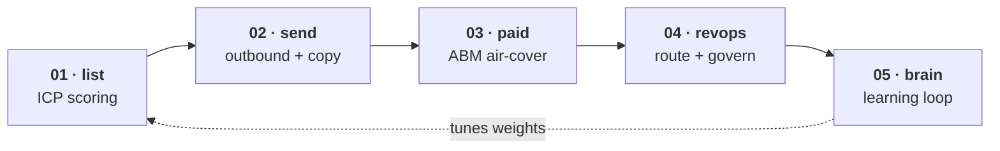

# kaikarma-gtm-engine

[](https://github.com/Kai8karma/kaikarma-gtm-engine/actions/workflows/ci.yml) [](LICENSE) [](https://www.python.org/downloads/) [](#tested-or-it-doesnt-count)

**A GTM engine that runs — not a folder of playbooks.** ICP scoring, paid-spend control under hard caps, lead routing, and a learning loop that tunes itself from real outcomes. All tested Python. All runnable in one command.

```bash
git clone https://github.com/Kai8karma/kaikarma-gtm-engine && cd kaikarma-gtm-engine
python3 examples/closed_loop.py     # stdlib only · no network · safe to run air-gapped
```

```text
PHASE 1 — Score accounts with DEFAULT weights
  A   82.7  SignalFirst Corp [job_change]
  B   63.0  TechBlind Inc [funding]
  B   61.3  FirmMatch Ltd
  D    2.0  OutOfBand LLC

PHASE 3 — Tune weights from closed-won/lost outcomes
  before: {firmographic: 40, technographic: 20, signal: 30, fit: 10}
  after:  {firmographic: 36, technographic: 16, signal: 38, fit: 10}

PHASE 4 — Re-score with TUNED weights
  SignalFirst Corp     A     82.7 → 85.3  (+2.6)
  FirmMatch Ltd        B→C   61.3 → 54.7  (-6.6)   ← pure-firmographic match demoted
```

The engine learned that *signal* (job changes, funding) predicted closes better than firmographic fit — and re-ranked the pipeline accordingly. No dashboard, no prompt-by-hand. Code that decides, logs, and improves.

Built by **Kai** ([@Kai8karma](https://github.com/Kai8karma)) — a solo GTM engineer who runs the full motion (list → send → paid → route → learn) like a five-person team. These frameworks aren't slides. They're decision functions you can read, test, and break.

---

## The motion



Pillars run in execution order: build the list → send → run paid air-cover at the same accounts → govern and route what comes back → learn from outcomes, which feeds back into who you target next.

| Engine | What it *decides* | Reference module |
|---|---|---|
| `01 · list` | Who to reach — ICP score 0–100, A/B/C/D tiers, weighted dimensions | [`icp_scorer.py`](01-list-engine/icp_scorer.py) |
| `02 · send` | Which copy framework per tier; SPF/DKIM/DMARC validity before send | [`sequencer.py`](02-send-engine/sequencer.py) |
| `03 · paid` | Scale / hold / cut / kill each campaign vs target CPA — under hard caps | [`perf_controller.py`](03-abm-paid-engine/perf_controller.py) |
| `04 · revops` | Route the lead, enforce SLA, decay stale data quality | [`lead_router.py`](04-revops-engine/lead_router.py) |
| `05 · brain` | Tune ICP weights from won/lost outcomes; persist across sessions | [`policy_tuner.py`](05-brain-integration/policy_tuner.py) |

---

## What makes it different

1. **Frameworks are code, not prose.** ICP scoring is a tested function, not a 100-point table you eyeball. Lead routing is a state machine. Data-quality decay is a scheduler. If it can't be run and tested, it's a blog post — and this repo holds itself to that bar.
2. **The loop learns — and the learning is *backtested*.** `05-brain-integration/` tunes scoring weights from closed-won/lost. Whether that actually helps was tested *before* it was claimed (see below). Proof before belief.
3. **Spend moves under hard caps.** The paid controller classifies each campaign against target and acts — scale/hold/cut/kill — but only inside guardrails, with a learning-phase grace window. Decisions emit through a swappable [execution boundary](03-abm-paid-engine/executor.py): **dry-run and zero-egress by default**, one adapter from live.
4. **Built like an operating system.** [`00-operating-system/`](00-operating-system/) encodes *how the engine decides* — strategy never calls live APIs, execution never makes strategic calls, engagement data stays isolated per client, and every change passes a verification gate.

---

## The learning loop (the part most repos skip)

Most GTM repos *assert* their method works. This one **tested whether it does — before claiming it.**

The loop tunes ICP weights from outcomes and, in a [pre-registered backtest](evals/DEC-learning-loop.md), captures **78% of the achievable ranking lift**. The absolute gain is small (**+3.2pp**), so the honest verdict was **PARK**, not ship-as-headline. That's the point: a method you can't measure is faith, and faith doesn't belong in a pipeline. The backtest is in [`evals/`](evals/) — read it, including where it falls short.

---

## Tested, or it doesn't count

**774 tests · ruff-clean · `bash tests/smoke.sh` exits 0** — CI gates every pillar, the full cross-pillar loop, the learning-loop backtest, and the whole-stack API layer on Python 3.11 / 3.12 / 3.13. Nothing ships unless the gate is green; the engine grows by verified loops.

**What's real:** all five engines run; the learning loop is wired end-to-end and persists across sessions ([`examples/persistent_loop.py`](examples/persistent_loop.py)); injected-client adapters exist for the whole motion — Apollo enrichment, HubSpot CRM, Google/Meta/LinkedIn ads (read + write) — pure, tested, zero-egress in tests.

**What's not (yet):** adapters are written from public API docs and are **not** validated against live accounts — live use needs your creds + a sandbox. The engine is *invoked*, not a always-on daemon. A magnitude-aware tuner to capture the remaining headroom is the next loop. (Stated plainly because the alternative is a demo that lies.)

---

## Architecture

```
kaikarma-gtm-engine/
├── 00-operating-system/   # how the engine decides — 3-layer split, governance, verification
├── 01-list-engine/        # who to reach — ICP as typed, tested code   ◀ reference module
├── 02-send-engine/        # outbound infra + copy frameworks as structured prompts
├── 03-abm-paid-engine/    # account targeting + paid-ads controllers (classify → act → cap)
├── 04-revops-engine/      # routing, lifecycle FSM, data-quality decay, reporting
├── 05-brain-integration/  # the learning loop — outcomes → tuned weights
├── examples/              # runnable end-to-end demos (start with closed_loop.py)
├── engagements/           # per-client isolation; _INDEX.md cites live state
├── evals/                 # pre-registered backtests — does the method actually work?
└── tests/                 # smoke + unit; nothing ships unverified
```

---

## Credits & license

Original work, MIT-licensed — use it, fork it, ship with it ([LICENSE](LICENSE)). Structural patterns from the best of the field are studied openly in [`research/teardowns/`](research/teardowns/); the ideas are credited there, the implementation is mine.

Building GTM systems and want to compare notes? Find me at [@Kai8karma](https://github.com/Kai8karma).
